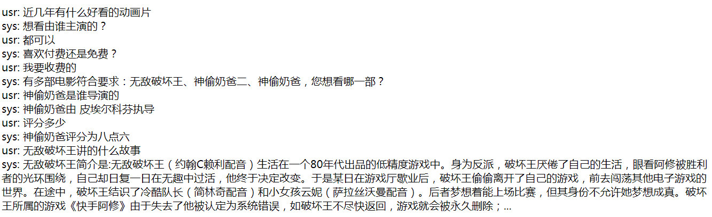

# Project：Iqiyi Movie Dialog System
This is the code for the demo of Iqiyi movie dialog system (爱奇艺电影对话系统) project.

## Data
Iqiyi Movie dialog data is available [here](http://oa.ee.tsinghua.edu.cn/~ouzhijian/news.htm)  
It has 800 dialogues collected and labeled under a crowdsourcing Wizard-of-Oz framework.  
The language is Chinese. For more information please refer to the paper:
```angular2html
Yinpei Dai, Zhijian Ou, Dawei Ren, and Pengfei Yu. Tracking of enriched dialog
states for flexible conversational information access. In 2018 IEEE International
Conference on Acoustics, Speech and Signal Processing (ICASSP 2018), Calgary, Canada.
``` 

## Requirements
+ Tensorflow >= 1.6
+ Jieba
+ Django 2.0.7

## Usage
### Demo testing
1. Change into the work directory, run `python manage.py runserver 8000`  
2. Open your web browser, enter the URL `localhost:8000/IqiyiProject/dialog`
3. Chat with the dialog agent like follows:


### Model training
In this code, the model has already been trained and saved in 
`model_ckpt` directory. If you want to re-train the model, please revise the 
`EDST_test_web.py` file.


